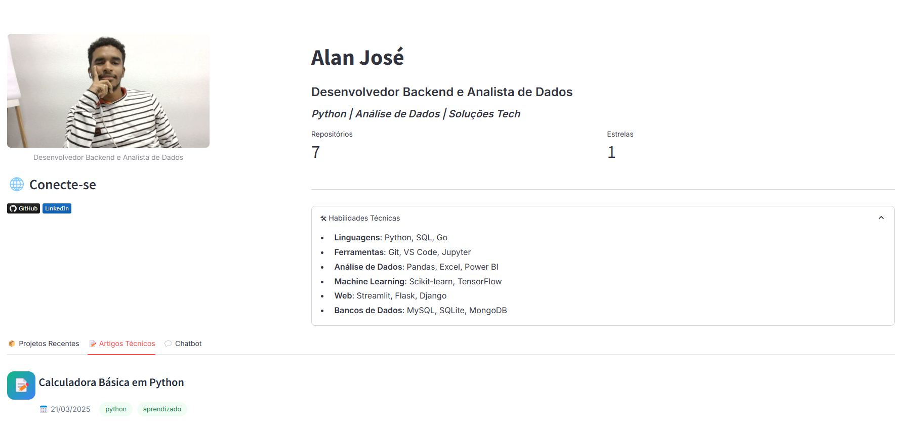

# BlogStreamlit 🚀

[](https://creativecommons.org/licenses/by/4.0/)
[](https://streamlit.io)
[](https://python.org)

Um blog moderno com autenticação de usuários, chatbot integrado e painel administrativo, desenvolvido com Streamlit e Python.

 <!-- Adicione suas imagens na pasta /images -->

---

## 📦 Recursos Principais
- 🔐 **Autenticação segura** de usuários
- 🤖 **Chatbot** com histórico de conversas
- ✍️ **CRUD** para posts e comentários
- 🛠️ **Painel administrativo** para gerenciamento
- 🎨 **Design responsivo** com componentes personalizados
- 🗄️ **Banco de dados integrado** para armazenamento eficiente

---

## ⚙️ Instalação

Clone o repositório e instale as dependências:

```bash
# Clone o repositório
git clone https://github.com/seu-usuario/blogstreamlit.git
cd blogstreamlit

# Instale as dependências
pip install -r requirements.txt
```

### 🚀 Como Executar

```bash
streamlit run main.py
```

---

## 📁 Estrutura do Projeto

```bash
blogstreamlit/
├── auth.py          # Autenticação de usuários
├── chatbot.py       # Lógica do chatbot
├── crud.py          # Operações de banco de dados
├── database.py      # Configuração do banco de dados
├── main.py          # Ponto de entrada principal
├── components/
│   ├── admin_panel.py  # Painel administrativo
│   ├── cards.py        # Componentes de layout
│   ├── header.py       # Cabeçalho da aplicação
│   └── styles.py       # Estilos CSS personalizados
└── images/          # Assets visuais
```

---

## 📄 Licença

Este projeto está licenciado sob a [Creative Commons Attribution 4.0 International License](https://creativecommons.org/licenses/by/4.0/). Você pode:

✅ Compartilhar e adaptar o código
✅ Usar para fins comerciais
❗ Condição: Deve dar os devidos créditos ao autor original.

---

## 👥 Contribuição

Contribuições são bem-vindas! Para contribuir, siga estes passos:

1. Faça um **Fork** do projeto
2. Crie sua **Branch** (`git checkout -b feature/nova-feature`)
3. Faça **Commit** das mudanças (`git commit -m 'Adiciona nova feature'`)
4. **Push** para a Branch (`git push origin feature/nova-feature`)
5. Abra um **Pull Request**

---

## 🛠️ Guia de Desenvolvimento

### 📏 Padrões de Código

- Seguir a **PEP8** para formatação de código
- Utilizar **Docstrings Google Style** para documentação

### ✅ Testes

Execute os testes com **pytest**:

```bash
pytest tests/
```

### 🌍 Ambiente Recomendado

- **Python 3.9+**
- **Virtualenv** para isolamento do ambiente

---

## ❓ Perguntas Frequentes (FAQ)

🔹 **Como personalizar o chatbot?**  
Modifique o arquivo `chatbot.py` e adicione novas intenções no dicionário `intents`.

🔹 **Posso usar outro banco de dados?**  
Sim! Basta modificar `database.py` para se conectar ao banco desejado.

🔹 **O projeto roda em Docker?**  
Ainda não, mas contribuições para adicionar suporte a Docker são bem-vindas!

---

## 📚 Citação

Se você usar este projeto em seu trabalho, por favor cite:

```bibtex
@misc{blogstreamlit,
  author = {Alan José},
  title = {BlogStreamlit},
  year = {2025},
  publisher = {GitHub},
  journal = {Repositório GitHub},
  howpublished = {\url{https://github.com/Mogutaa/blogstreamlit}}
}
```


## 📑 Documentação Adicional

### `requirements.txt`

```txt
altair==5.5.0
attrs==25.3.0
bcrypt==4.3.0
blinker==1.9.0
cachetools==5.5.2
captcha==0.7.1
certifi==2025.1.31
cffi==1.17.1
charset-normalizer==3.4.1
click==8.1.8
colorama==0.4.6
cryptography==44.0.2
dnspython==2.7.0
extra-streamlit-components==0.1.71
gitdb==4.0.12
GitPython==3.1.44
idna==3.10
Jinja2==3.1.6
jsonschema==4.23.0
jsonschema-specifications==2024.10.1
Markdown==3.7
MarkupSafe==3.0.2
narwhals==1.31.0
numpy==2.2.4
packaging==24.2
pandas==2.2.3
pillow==11.1.0
plotly==6.0.1
prettytable==3.15.1
protobuf==5.29.3
pyarrow==19.0.1
pycparser==2.22
pydeck==0.9.1
pyecharts==2.0.8
PyJWT==2.10.1
pymongo==4.11.3
python-dateutil==2.9.0.post0
python-decouple==3.8
python-dotenv==1.0.1
pytz==2025.1
PyYAML==6.0.2
referencing==0.36.2
requests==2.32.3
rpds-py==0.23.1
simplejson==3.20.1
six==1.17.0
smmap==5.0.2
streamlit==1.43.2
streamlit-aggrid==1.1.2
streamlit-authenticator==0.2.2
streamlit-echarts==0.4.0
streamlit-elements==0.1.0
tenacity==9.0.0
toml==0.10.2
tornado==6.4.2
typing_extensions==4.12.2
tzdata==2025.1
urllib3==2.3.0
watchdog==6.0.0
wcwidth==0.2.13
```


